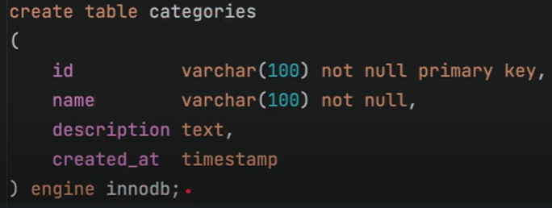
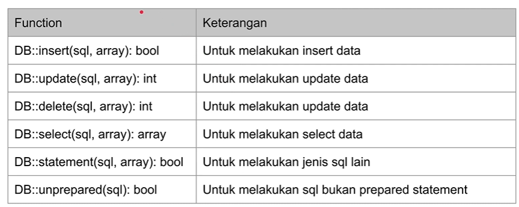
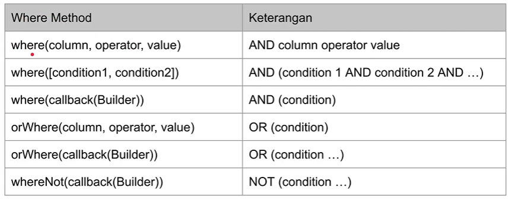
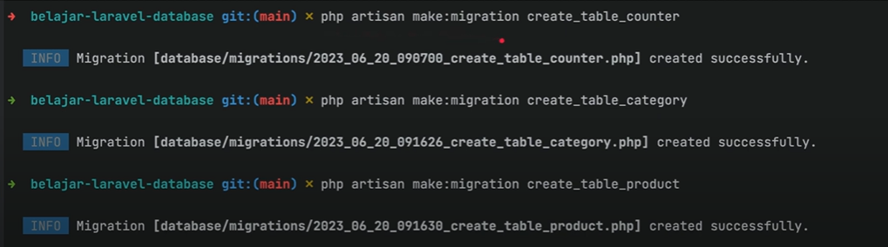

# LARAVEL DATABASE

## POINT UTAMA

### 1. Instalasi

-   Minimal PHP versi 8 atau lebih,

-   Composer versi 2 atau lebih,

-   Lalu pada cmd ketikan `composer create-project laravel/laravel=v10.2.3 belajar-laravel-database`.

---

### 2. Laravel Database

-   Semua konfigurasi database di Laravel di simpan didalam directory `config/database.php`.

---

### 3. Membuat database

-   Buat database menggunakan MySQL dengan nama `belajar_laravel_database`,

-   Lalu buat table dengan nama `categories`.

    

---

### 4. Debug Query

-   Kita bisa gunakan `DB::listen()` untuk melakukan debugging SQL query yang dibuat di Laravel,

-   `DB::listen()` akan dipanggil setiap ada operasi yang dilakukan oleh Laravel Database,

-   Kita bisa me-log query misalnya, kita daftarkan `DB::listen()` pada Service Provider.

    ```PHP
    public function boot(): void
    {
        //
        DB::listen(function (QueryExecuted $query){
            Log::info($query->sql);
        });
    }
    ```

-   Nanti kita bisa melihat apa yang sudah pernah kita log di folder `storage/logs/laravel.log`.

---

### 5. CRUD SQL

-   Dengan menggunakan DB Facade, kita bisa melakukan `Raw Query` (Query ke database secara manual),

-   Function Raw SQL

    

-   Kode Raw SQL

    ```PHP
    protected function setUp(): void // setUp saat query dimulai maka data akan dihapus terlebih dahulu
    {
        parent::setUp(); // TODO: Change the autogenerated stub
        DB::delete('delete from categories');
    }

    public function testCrud()
    {
        DB::insert('insert into categories(id, name, description, created_at) values (?, ?, ? , ?)', [
            "GADGET", "Gadget", "Gadget Category", "2020-10-10 10:10:10"
        ]);

        $results = DB::select('select * from categories where id = ?',  ['GADGET']);

        self::assertCount(1, $results);
        self::assertEquals('GADGET', $results[0]->id);
        self::assertEquals('Gadget', $results[0]->name);
        self::assertEquals('Gadget Category', $results[0]->description);
        self::assertEquals("2020-10-10 10:10:10", $results[0]->created_at);
    }
    ```

-   Hasil log akan di simpan di folder `storage/logs.laravel.log`.

---

### 6. Named Binding

-   Laravel mendukung fitur bernama binding, sehingga kita bisa mengganti `?` (tanda tanya) menjadi nama parameter,

-   Dan data bisa kita kirim menggunakan _array_ dengan menggunakan _key_ sesuai nama parameter.

-   kode Named Binding

    ```PHP
    public function testCrudNamedParameter()
    {
        DB::insert('insert into categories(id, name, description, created_at) values (:id, :name, :description , :created_at)', [
            "id" => "GADGET",
            "name" => "Gadget",
            "description" => "Gadget Category",
            "created_at" => "2020-10-10 10:10:10",
        ]);

        $results = DB::select('select * from categories where id = ?',  ['GADGET']);

        self::assertCount(1, $results);
        self::assertEquals('GADGET', $results[0]->id);
        self::assertEquals('Gadget', $results[0]->name);
        self::assertEquals('Gadget Category', $results[0]->description);
        self::assertEquals("2020-10-10 10:10:10", $results[0]->created_at);
    }
    ```

---

### 7. Database Transaction

-   Laravel Database memiliki fitur untuk melakukan database transaction secara otomatis,

-   Dengan begitu, tidak perlu lagi melakukan start transaction dan commit/rollback secara manual lagi,

-   Kita bisa menggunakan _function_ `DB::transaction(function)`,

-   Didalam _function_ tersebut kita bisa melakukan perintah database, jika terjadi _error_ secara otomatis transaksi akan di _rollback_.

-   Kode Database Transaction

    ```PHP
    public function testTransactionSuccess()
    {
        DB::transaction(function () {
            DB::insert('insert into categories(id, name, description, created_at) values (?, ?, ? , ?)', [
                "GADGET", "Gadget", "Gadget Category", "2020-10-10 10:10:10"
            ]);
            DB::insert('insert into categories(id, name, description, created_at) values (?, ?, ? , ?)', [
                "FOOD", "Food", "Food Category", "2020-10-10 10:10:10"
            ]);
        });

        $results = DB::select("select * from categories");
        self::assertCount(2, $results);
    }
    ```

-   Selain menggunakan fitur otomatis, juga bisa melakukan database transaction secara manual,

-   Beberapa _function_ yang bisa digunakan:

    -   `DB::beginTransaction()` untuk memulai transaction,
    -   `DB::commit()` untuk melakukan commit transaksi,
    -   `DB::rollBack()` untuk rollback transaksi.

-   Kode Manual Transaksi

    ```PHP
    public function testTransactionFailed() // test transaksi manual gagal
    {
        try {
            DB::transaction(function () {
                DB::insert('insert into categories(id, name, description, created_at) values (?, ?, ? , ?)', [
                    "GADGET", "Gadget", "Gadget Category", "2020-10-10 10:10:10"
                ]);
                DB::insert('insert into categories(id, name, description, created_at) values (?, ?, ? , ?)', [
                    "GADGET", "Food", "Food Category", "2020-10-10 10:10:10"
                ]);
            });
        } catch (QueryException $error) {
            // expected
        }

        $results = DB::select("select * from categories");
        self::assertCount(0, $results);

    }

    public function testMaualTransactionSuccess() // test transaksi manual sukses
    {
        try {
            DB::beginTransaction();
            DB::insert('insert into categories(id, name, description, created_at) values (?, ?, ? , ?)', [
                "GADGET", "Gadget", "Gadget Category", "2020-10-10 10:10:10"
            ]);
            DB::insert('insert into categories(id, name, description, created_at) values (?, ?, ? , ?)', [
                "FOOD", "Food", "Food Category", "2020-10-10 10:10:10"
            ]);
            DB::commit();
        } catch (QueryException $error) {
            DB::rollBack();
        }

        $results = DB::select("select * from categories");
        self::assertCount(2, $results);
    }
    ```

---

### 8. Database Commands

-   Artisan Laravel memiliki banyak fitur, termasuk perintah database (db). Beberapa perintah yang dapat digunakan antara lain:

    -   `php artisan db`: mengakses terminal database, seperti MySQL,
    -   `php artisan db:table`: melihat seluruh tabel di database,
    -   `php artisan db:show`: melihat informasi database,
    -   `php artisan db:monitor`: memonitor jumlah koneksi di database,
    -   `php artisan db:seed`: menambah data di database,
    -   `php artisan db:wipe`: menghapus seluruh tabel di database.

---

### 9. Query Builder

-   Laravel memiliki fitur _Query Builder_, fitur ini sangat memmpermudah kita saat ketika ingin membuat perintah ke database dibandingkan melakukan secara manual menggunakan _Raw SQL_,

-   Untuk membuat _Query Builder_ bisa menggunakan _function_ `DB::table(nama)`.

-   Untuk melakukan insert _Query Builder_, kita bisa menggunakan method dengan prefix insert dengan parameter `assosiative array` dimana _key_ nya adalah kolom, dan value nya adalah nilai yang akan disimpan di database.

-   `insert() `untuk memasukkan data ke database, _throw exception_ jika terjadi _error_ misal duplicate primary key.

-   `insertGetId()` untuk memasukkan dåta ke database, dan mengembalikan primary key yang diset
    secara auto generate, cocok untuk tabel dengan id auto increment

-   `insertOrIgnore()` untuk memasukkan data ke database, dan jika terjadi _error_, maka akan di ignore

-   kode Query Builder

    ```PHP
     public function testInsert()
    {
        DB::table("categories")->insert([
            "id" => "GADGET",
            "name" => "Gadget"
        ]);
        DB::table("categories")->insert([
            "id" => "FOOD",
            "name" => "Food"
        ]);

        $result = DB::select("select count(id) as total from categories");
        self::assertEquals(2, $result[0]->total);
    }
    ```

---

### 10. Query builder Select

-   Beberapa perintah _Query Builder Select_:

    -   `get(columns)` untuk mengambil seluruh data, defaultnya semua kolom diambil,
    -   `first(columns)` untuk mengambil data pertama, defaultnya semua kolom diambil,
    -   `pluck(columns)` untuk mengambil salah satu kolom saja,

-   Hasil dari _Query Builder Select_ adalah Laravel Collection.

-   Kode Query Builder Select

    ```PHP
     public function testSelect()
    {
        $this->testInsert();

        $collection = DB::table("categories")->select(["id", "name"])->get();
        self::assertNotNull($collection);

        $collection->each(function ($item) {
            Log::info(json_encode($item));
        });
    }
    ```

---

### 11. Query builder Where

-   Untuk menambahakan _Where_ di _Query Builder_, bisa menggunakan banyak sekali method.

-   Method Where

    

-   Kode Insert Category

    ```PHP
    public function insertCategories(){
        DB::table("categories")->insert([
            "id" => "SMARTPHONE",
            "name" => "smartphone",
            "created_at" => "2024-05-21:15:00",
        ]);
        DB::table("categories")->insert([
            "id" => "FOOD",
            "name" => "food",
            "created_at" => "2024-05-21:15:00",
        ]);
        DB::table("categories")->insert([
            "id" => "LAPTOP",
            "name" => "laptop",
            "created_at" => "2024-05-21:15:00",
        ]);
        DB::table("categories")->insert([
            "id" => "FASION",
            "name" => "fasion",
            "created_at" => "2024-05-21:15:00",
        ]);
    }
    ```

-   Kode Where Method

    ```PHP
       public function testWhere()
    {
        $this->insertCayegories();

        DB::table("categories")->where(function(builder $builder){
            $builder->where('id', '=', 'SMARTPHONE');
            $builder->orWhere('id', '=', 'SMARTPHONE');
        })->get();

        self::assertCount(2, $collection);
        $collection->each(function($item){
            Log::info(json_encode($item));
        });
    }
    ```

---

### 12. Query Builder Update

-   Untuk melakukan update, bisa menggunakan method `update(array)`,

-   Dimana parameternya kita bisa mengirim assosiative array yang berisi kolom -> value.

-   kode Query Builder Update

    ```PHP
    public function testUpdate()
    {
        $this->insertCategories();

        DB::table("categories")->where("id", "=", "SMARTPHONE")->update([
            "name" => "Handphone"
        ]);

        $collection = DB::table("categories")->where("name", "=", "Handphone")->get();
        self::assertCount(1, $collection);
        $collection->each(function ($item) {
            Log::info(json_encode($item));
        });
    }
    ```

---

### 13. Query Builder Upsert (Update or Insert)

-   Method digunakan ketika mencoba melakukan update, jika datanya tidak ada maka akan dilakukan insert data baru,

-   Gunakan method `updateOrInsert(attributes, value)`.

-   Kode Upsert

    ```PHP
    public function testUpsert()
    {
        DB::table("categories")->updateOrInsert([
            "id" => "VOUCHER"
        ], [
            "name" => "Voucher",
            "description" => "Ticket and Voucher",
            "created_at" => "2020-10-10 10:10:10"
        ]);

        $collection = DB::table("categories")->where("id", "=", "Voucher")->get();
        self::assertCount(1, $collection);
        $collection->each(function ($item) {
            Log::info(json_encode($item));
        });
    }
    ```

---

### 14. Increment & Decrement

-   Gunakan method `increment(column, increment)` untuk melakukan increment,

-   Dan gunakan method `decrement(column, decrement)` untuk melakukan decrement.

-   Kode Increment

    ```PHP
    public function testIncrement()
    {
        $this->seed(CounterSeeder::class);

        DB::table("counters")->where('id', '=', 'sample')->increment('counter', 1);

        $collection = DB::table("counters")->where('id', '=', 'sample')->get();
        self::assertCount(1, $collection);
        $collection->each(function ($item) {
            Log::info(json_encode($item));
        });
    }
    ```

---

### 15. Query Builder Delete

-   Gunakan method `delete()` untuk melakukan delete SQL delete dan `truncate()` untuk melakukan truncate table.

-   kode Delete

    ```PHP
     public function testDelete()
    {
        $this->insertCategories();

        DB::table("categories")->where('id', '=', 'SMARTPHONE')->delete();

        $collection = DB::table("categories")->where("id", "=", "SMARTPHONE")->get();
        self::assertCount(0, $collection);
    }
    ```

---

### 16. Query Builder Ordering

-   Method `orderBy(column, order)` adalah method untuk mempermudah pengurutan data, dimana order bisa _asc_ atau _desc_.

-   kode Order

    ```PHP
     public function testOrdering()
    {
        $this->insertProducts();

        $collection = DB::table("products")->whereNotNull("id")
            ->orderBy("price", "desc")->orderBy("name", "asc")->get();

        self::assertCount(2, $collection);
        $collection->each(function ($item) {
            Log::info(json_encode($item));
        });
    }
    ```

---

### 17. Chunk Result

-   Saat kita membuat aplikasi, kadang ada kasus kita mengelola data dengan ukuran besar,

-   Secara default, semua query yang kita lakukan di Laravel, akan di load ke Memory sebagai _Collection_,

-   Hal ini berbahaya ketika hasil query nya banyak, karena bisa berakibat terjadi error Out Of Memory,

-   Dari pada kita me load semua data ke Memory, kita bisa memotong data hasil query secara bertahap menggunakan method `chunk()`,

-   Implementasi _chunk_ sebenarnya adalah dengan melakukan paging,

-   Dan jika ingin menggunakan _chunk_, kita harus menambahkan ordering pada query nya.

-   Kode Chunk

    ```PHP
    public function insertManyCategories() // perulangan sampai seratus
    {
        for ($i = 0; $i < 100; $i++) {
            DB::table("categories")->insert([
                "id" => "CATEGORY-$i",
                "name" => "Category $i",
                "created_at" => "2020-10-10 10:10:10"
            ]);
        }
    }

    public function testChunk()
    {
        $this->insertManyCategories();

        DB::table("categories")->orderBy("id")
            ->chunk(10, function ($categories) {
                self::assertNotNull($categories);
                Log::info("Start Chunk");
                $categories->each(function ($category) {
                    Log::info(json_encode($category));
                });
                Log::info("End Chunk");
            });
    }
    ```

---

### 18. Lazy Result

-   Fitur Lazy di Laravel, dimana kita bisa menjadikan _Query Builder_ dengan Lazy Result yang menghasilkan Lazy Collection.

-   Kode Lazy

    ```PHP
      public function testLazy()
    {
        $this->insertManyCategories();

        $collection = DB::table("categories")->orderBy("id")->lazy(10)->take(3);
        self::assertNotNull($collection);

        $collection->each(function ($item) {
            Log::info(json_encode($item));
        });
    }
    ```

---

### 19. Cursor

-   Selain menggunakan Lazy, bisa menggunakan Cursor untuk membuat Lazy Result,

-   Chunk dan Lazy sebenarnya melakukan paging dibelakang layar, sementara Cursor hanya akan melakukan query satu kali.

-   Kode Cursor

    ```PHP
      public function testCursor()
    {
        $this->insertManyCategories();

        $collection = DB::table("categories")->orderBy("id")->cursor();
        self::assertNotNull($collection);

        $collection->each(function ($item) {
            Log::info(json_encode($item));
        });
    }
    ```

---

### 20. Query Builder Aggregate

-   Query Builder Aggregate juga mendukung banyak method:

    -   `count(column)` untuk jumlah data,
    -   `min(column)` untuk minimal data,
    -   `max(column)` untuk maksimal data,
    -   `avg(column)` untuk rata-rata data,
    -   `sum(column)` untuk menjumlahkan data,

-   Kode Aggregate

    ```PHP
    public function testAggregate()
    {
        $this->insertProducts();

        $result = DB::table("products")->count("id");
        self::assertEquals(2, $result);

        $result = DB::table("products")->min("price");
        self::assertEquals(18000000, $result);

        $result = DB::table("products")->max("price");
        self::assertEquals(20000000, $result);

        $result = DB::table("products")->avg("price");
        self::assertEquals(19000000, $result);

        $result = DB::table("products")->sum("price");
        self::assertEquals(38000000, $result);
    }
    ```

-   Query Builder juga bisa melakukan grouping

-   Kode Grouping

    ```PHP
    public function testGroupBy()
    {
        $this->insertProducts();
        $this->insertProductFood();

        $collection = DB::table("products")
            ->select("category_id", DB::raw("count(*) as total_product"))
            ->groupBy("category_id")
            ->orderBy("category_id", "desc")
            ->get();

        self::assertCount(2, $collection);
        self::assertEquals("SMARTPHONE", $collection[0]->category_id);
        self::assertEquals("FOOD", $collection[1]->category_id);
        self::assertEquals(2, $collection[0]->total_product);
        self::assertEquals(2, $collection[1]->total_product);
    }
    ```

---

### 21. Having

-   Di SQL kita bisa menambahkan _Having_ ketika menggunakan Group By,

-   Di Laravel juga bisa menggunakan method `having(column, operator, value)`.

-   kode Having

    ```PHP
      public function testGroupByHaving()
    {
        $this->insertProducts();
        $this->insertProductFood();

        $collection = DB::table("products")
            ->select("category_id", DB::raw("count(*) as total_product"))
            ->groupBy("category_id")
            ->having(DB::raw("count(*)"), ">", 2)
            ->orderBy("category_id", "desc")
            ->get();

        self::assertCount(0, $collection);
    }
    ```

---

### 22.Pagination

-   Saat membuat aplikasi Web atau RESTful API yang mengembalikan data di database, kita sering memberi informasi tentang pagination, misal jumlah record, jumlah page, page saat ini, dan lain-lain,

-   Jika kita lakukan semuanya secara manual, maka lumayan memakan waktu,

-   Untungnya Laravel memiliki fitur pagination, dimana kita bisa menggunakan method `paginate()`, dan secara otomatis akan mengembalikan _object LengthAware Pagination_.

-   Kode Pagination

    ```PHP
    public function testPagination()
    {
        $this->insertCategories();

        $paginate = DB::table("categories")->paginate(perPage: 2, page: 2);

        self::assertEquals(2, $paginate->currentPage());
        self::assertEquals(2, $paginate->perPage());
        self::assertEquals(2, $paginate->lastPage());
        self::assertEquals(4, $paginate->total());

        $collection = $paginate->items();
        self::assertCount(2, $collection);
        foreach ($collection as $item) {
            Log::info(json_encode($item));
        }
    }
    ```

-   Dan untuk melakukan iterasi semua halaman, kita bisa lakukan dengan cara menaikan nilai dari parameter page 1 sampai page terakhir.

-   Kode Itersi per Page

    ```PHP
      public function testIterateAllPagination()
    {
        $this->insertCategories();

        $page = 1;

        while (true) {
            $paginate = DB::table("categories")->paginate(perPage: 2, page: $page);

            if ($paginate->isEmpty()) {
                break;
            } else {
                $page++;

                $collection = $paginate->items();
                self::assertCount(2, $collection);
                foreach ($collection as $item) {
                    Log::info(json_encode($item));
                }
            }
        }
    }
    ```

---

### 23. Database Migration

-   Laravel memiliki fitur bernama _Database Migration_, fitur ini digunakan untuk melakukan _versioning schema database_, dimana setiap perubahan akan di _track_ sehingga akan selalu konsisten,

-   Dengan ini Database Migration, tidak perlu mengubah schema database secara manual.

-   Untuk membuat database migration ketikan pada terminal perintah `php artisan make:migration nama_file_migration`,

    

-   Kode Create Table Counters

    ```PHP
     public function up(): void
    {
        Schema::create('counters', function (Blueprint $table) {
            $table->string('id', 100)->nullable(false)->primary();
            $table->integer('counter')->nullable(false)->default(0);
        });
    }

     public function down(): void
    {
        Schema::dropIfExists('counters');
    }
    ```

-   Kode Create Table Category

    ```PHP
    public function up(): void
    {
        Schema::create('categories', function (Blueprint $table) {
            $table->string("id", 100)->nullable(false)->primary();
            $table->string("name", 100)->nullable(false);
            $table->text("description")->nullable(true);
            $table->timestamp("created_at")->nullable(false)->useCurrent();
        });
    }

    public function down(): void
    {
        Schema::dropIfExists('categories');
    }
    ```

-   Cara menjalankan database migration bisa ketikan `php artisan migrate` pada terminal,

-   Dan `php artisan migrate:status` untuk melihat status migration.

-   Jika ingin membatalkan migration tersebut bisanya disebut _rollback_,

-   Untuk melakukan _rollback_ ketikan perintah pada terminal `php artisan migrate:rollback --step=jumlah`, "jumlah" berisikan angka jumlah file migration yang akan di rollback.

---

### 24. Database Seeding

-   Sebelumnya saat membuat unit test, sering kali insert data terlebih dahulu, Ini disebut _seeding_ yaitu mengubah (insert update & delete) data di database,

-   Gunakan perintah `php artisan make:seeder NamaSeeder` untuk membuat _seeding_ baru di Laravel,

-   Secara otomatis akan dibuatkan folder `database/seeder`.

-   Gunakan perintah `php artisan db:seed --class=ClassSeeder` untuk menjalankan perintah seeder.

-   Kode Counter Seeder

    ```PHP
    public function run(): void
    {
        DB::table("counters")->insert([
            "id" => "sample",
            "counter" => 0
        ]);
    }
    ```

-   Kode Category Seeder

    ```PHP
    public function run(): void
    {
        DB::table("categories")->insert([
            "id" => "SMARTPHONE",
            "name" => "Smartphone",
            "created_at" => "2020-10-10 10:10:10"
        ]);
        DB::table("categories")->insert([
            "id" => "FOOD",
            "name" => "Food",
            "created_at" => "2020-10-10 10:10:10"
        ]);
        DB::table("categories")->insert([
            "id" => "LAPTOP",
            "name" => "Laptop",
            "created_at" => "2020-10-10 10:10:10"
        ]);
        DB::table("categories")->insert([
            "id" => "FASHION",
            "name" => "Fashion",
            "created_at" => "2020-10-10 10:10:10"
        ]);
    }
    ```

-   Unit Test Seeder

    ```PHP
    public function insertCategories()
    {
        $this->seed(CategorySeeder::class);
    }

    public function testWhere()
    {
        $this->insertCategories();

        $collection = DB::table("categories")->where(function (Builder $builder) {
            $builder->where('id', '=', 'SMARTPHONE');
            $builder->orWhere('id', '=', 'LAPTOP');
            // SELECT * FROM categories WHERE (id = smartphone OR id = laptop)
        })->get();

        self::assertCount(2, $collection);
        $collection->each(function ($item) {
            Log::info(json_encode($item));
        });

    }
    ```

---

## PERTANYAAN & CATATAN TAMBAHAN

-   Tidak ada

---

### KESIMPULAN

-   Pembelajaran Laravel Database mencakup berbagai aspek penting dalam menggunakan database di Laravel. Mengajarkan cara mengonfigurasi database, membuat dan menjalankan migrasi, menggunakan Eloquent ORM untuk berinteraksi dengan tabel, dan membuat query database yang efisien. Selain itu, dijelaskan juga tentang validasi data, relasi antar tabel, dan pengelolaan data dengan CRUD (Create, Read, Update, Delete) operations
